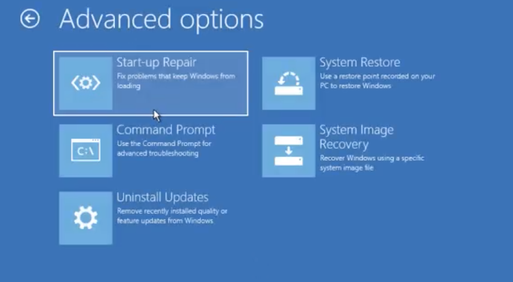

I recently moved all of my personal development environment into my macbook pro, so I just spent some time cleaning up my Windows PC throughout the weekend. A while ago, I set up a dual-boot Windows & Ubuntu (My PC native OS is Windows 10 Home). I encountered an issue where my PC boot-up mode entered and stuck in `grub rescue>` mode. Here's how I managed to solve it

## How I removed Ubuntu from Dual-Boot System

I felt that my method of removing Ubuntu from the Dual Boot system was not clean so keep in mind that you might want to explore other options too but most people tend to do it the way I did it. Also, make sure to back up any content from your Ubuntu system if needed.

For a Ubuntu to exist in a dual-boot system, it had to be set up in a partition drive.

1. On windows search bar, type `partition` then you should be directed to a few options. You want to choose `Create and format hard disk partitions`. You can also find this under the good old control panel

Example view of the Disk Management Panel

2. You need to know which drive you use for Ubuntu. Right click on the drive and select `Delete Volume` to delete the Ubuntu system

Now you have successfully remove Ubuntu. 

## Avoid Grub Rescue Issue

After removing the partition, I made a mistake of just restarting the machine directly while my `grub` configuration remained in the system drive.

Grub will try to indentify both Ubuntu and Windows while booting up. Since Ubuntu was removed, it would not be able to find Ubuntu so it would enter grub rescue mode.

One way you could resolve this before restarting your PC is by removing Ubuntu from EFI folder. To do that:
1. Find the directory where EFI folder exist. Usually it's located in your `Local Disk`. Mine was in `F:/EFI`. The typical other folder here would be:
* `BOOT`
* `microsoft`
* `ubuntu`

2. Delete ubuntu folder

At this point, you should be able to avoid Grub Rescue Mode after restarting your PC. 

## Grub Rescue Issue
When you start-up your PC machine, the boot system might take you to a black screen with the following interface

    error: no such device : cc6ade-4fba-4712-8177-a09649fc32b8
    error: unknown filesystem.
    Entering rescue mode...
    grub rescue> 

For some people, the previous steps of removing ubuntu folder would not keep them away from having their machine entering grub rescue mode, including myself. So here's what I did to resolve it.

To follow my method, You will need: 
* an empty USB drive at least 5 GB
* a separate laptop to burn Windows Disc Image (ISO file)

Before turning the PC on:
1. Use a separate machine to [download Windows ISO image](https://www.microsoft.com/en-us/software-download/windows10ISO)
2. Burn the downloaded ISO file to the USB drive. You can use [Rufus](https://rufus.ie/) if you're using a windows laptop to burn the disc or [Etcher](https://www.balena.io/etcher/) if you're using a mac (you might need some additional steps to configure the burning settings with Etcher).

Now you can use the USB drive with Windows image to get away from the grub rescue

## Resolving Grub Rescue Mode

1. Plug in USB drive into your PC
2. Turn on PC and enter BIOS mode when your machine display its first screen (for my machine, I had to press F11 button. This varies depending on your machine)
3. Select to boot from the `USB Drive UEFI` (not the `USB Drive` option)
4. You will be prompted a Windows Installation Panel. Select `Next`.
5. On the bottom left of the screen, select `repair your computer`
6. Select `Command Prompt` option

7. Enter the command to fix the master boot record

        > bootrec /fixmbr

8. Command to fix the boot sector to the system partition

        > bootrec /fixboot

if you are receiving `Access Denied` response, check one possible way to resolve it [here](#getting-access-denied-from-fixboot)

9. Exit the command prompt, turn off the PC and start the PC again. You should no longer be prompted into the grub rescue mode.

## Getting Access Denied from Fixboot

if you're being denied from executing `bootrec /fixboot` command, here's how you could resolve it:

1. Remain in the command prompt of the windows image on your USB Drive from previous step

2. Enter the following command line

        > diskpart

Then,

    > list vol 

3. `X` is the volume number from the list with a label similar to `System Reserve / EFI Partition`

        > sel vol X 

4. 

        > assign letter=Z

or any other letter that's not in used

5. 

        > exit

6. 

        > format z: /FS:FAT32

Then, answer all prompted questions with `yes` or `y`

7. When it prompts the following question, answer with `Recovery`.

    Volume label(11 Characters, ENTER for none)? Recovery

8. Find a directory with a base folder `\Windows`. For example

        > G:
        G:\> Dir 

to see the directory within a drive assigned to letter `G`
at this point, you should remember 2 things:

* the letter assign to a drive with the label `System Reserve / EFI Partition` (let's assume it's `X:` in this example)

* the letter assign to a drive where `windows folder exist` (let's assume it's `G:` in this example)

9. Assuming drive `G:` is where the folder `windows` exist, execute the following

        G:/> bcdboot G:\windows /s X: /f all

10. Exit the command prompt and turn off the machine.

11. Unplug the USB.

By now, you should be able to start your windows PC machine normally without the dual-boot system and grub rescue issue.

